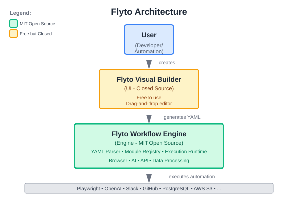

<div align="center">
  

  # Flyto2

  **The Git-Native Workflow Automation Engine**

  Browser automation + AI + API integration in portable YAML workflows

  [](LICENSE)
  [](https://www.python.org/downloads/)
  [](CONTRIBUTING.md)
</div>

---

## Why Flyto2?

**Your workflows shouldn't be trapped in a database.**

Flyto2 treats workflows as **version-controlled YAML files** - not proprietary JSON locked in a database. Perfect for teams who need:

✅ **Git-Native Workflows** - Diff, PR review, version control
✅ **Browser + AI + APIs** - Playwright, OpenAI, Slack, GitHub in one engine
✅ **Deploy Anywhere** - Local, Docker, Kubernetes, Lambda
✅ **No Vendor Lock-in** - YAML files run anywhere

**Best for:** DevOps automation, web scraping + AI, internal tools, data pipelines

---

## Quick Start

```bash
# 1. Install
git clone https://github.com/flytohub/flyto2.git
cd flyto2
pip install -r requirements.txt
playwright install chromium

# 2. Run example (non-interactive mode)
python -m src.cli.main workflows/google_search.yaml

# Or use interactive mode (select workflow from menu)
python -m src.cli.main

# 3. Create your own
cat > my_workflow.yaml <<EOF
name: "Hello Automation"
steps:
  - id: greet
    module: notification.slack.send_message
    params:
      text: "Workflow engine is running!"
EOF

export SLACK_WEBHOOK_URL=https://hooks.slack.com/...
python -m src.cli.main my_workflow.yaml
```

**That's it!** You're automating with YAML workflows.

### CLI Modes

Flyto2 CLI supports two execution modes:

**Non-Interactive Mode** (for automation, CI/CD, cron jobs):
```bash
python -m src.cli.main workflows/example.yaml           # Direct execution
python -m src.cli.main workflows/example.yaml --lang zh # Specify language
python -m src.cli.main example.yaml --params '{...}'    # Pass parameters
```

**Interactive Mode** (for manual testing, learning):
```bash
python -m src.cli.main  # Interactive menu: select language → workflow → parameters
```

---

## What Makes This Different

| Feature | Flyto2 | n8n | Zapier | Airflow |
|---------|--------|-----|--------|---------|
| **Workflow Format** | ✅ YAML files | JSON in database | Proprietary | Python code |
| **Git Version Control** | ✅ Native | Manual export | ❌ No | ✅ Native |
| **Browser Automation** | ✅ Playwright | Limited | ❌ No | ❌ No |
| **Portable** | ✅ Run anywhere | Needs n8n instance | ❌ Cloud only | Needs Airflow |
| **Open Source Engine** | ✅ MIT | Fair-code license | ❌ Closed | ✅ Apache |

**Use n8n if:** You want a database-backed UI for API integrations
**Use Flyto2 if:** You need Git workflows, browser automation, or YAML portability

---

## Built-in Integrations

Flyto2 comes with **85 production-ready modules** organized by architecture:

### Atomic Modules (52 modules)
Core building blocks with no external dependencies:
- **Browser** - Launch, navigate, click, type, extract, screenshot, press, find, wait (9)
- **File** - Read, write, exists, delete, move, copy (6)
- **String** - Split, replace, regex, trim, lowercase, uppercase, titlecase (7)
- **Array** - Filter, sort, unique, map, reduce, join (6)
- **Data** - CSV read/write, JSON parse/stringify, text templates (5)
- **Math** - Calculate, round, floor, ceil, abs, power (6)
- **Element** - Query, text, attribute (3)
- **Utilities** - Delay, random numbers/strings, datetime operations (format, parse, add, subtract), hash (9)
- **Flow** - Loop control (1)

### Third-party Integrations (33 modules)
Connect to external services and platforms:
- **AI** - OpenAI GPT/DALL-E, Anthropic Claude, Google Gemini, AI Agents (autonomous, chain) (6)
- **Communication** - Slack, Discord, Telegram, Email SMTP (4)
- **Databases** - PostgreSQL, MySQL, MongoDB find/insert, Redis get/set (6)
- **Cloud** - AWS S3, Google Cloud Storage, Azure Blob Storage (6)
- **Productivity** - Notion pages/databases, Google Sheets read/write (4)
- **Developer** - GitHub repos/issues/create, HTTP GET/POST, Google Search, SerpAPI (7)

[View complete module list](docs/MODULES.md)

---

## Real-World Examples

### Example 1: GitHub Issues → Slack Alerts

```yaml
name: "Monitor GitHub Issues"

steps:
  - id: fetch_issues
    module: api.github.list_issues
    params:
      owner: "facebook"
      repo: "react"
      state: "open"
      labels: "bug"
      token: "${env.GITHUB_TOKEN}"

  - id: notify
    module: notification.slack.send_message
    if: "${fetch_issues.count > 10}"
    params:
      text: "⚠️ ${fetch_issues.count} open bugs!"
```

**Deploy:**
```bash
export GITHUB_TOKEN=ghp_xxxxx
export SLACK_WEBHOOK_URL=https://hooks.slack.com/...
python -m src.cli.main github_monitor.yaml
```

**Schedule (cron):**
```bash
*/15 * * * * cd /app && python -m src.cli.main github_monitor.yaml
```

### Example 2: Web Scraping → CSV Export

```yaml
name: "Scrape Product Prices"

steps:
  - id: browser
    module: core.browser.launch
    params:
      headless: true

  - id: navigate
    module: core.browser.goto
    params:
      browser: "${browser.browser}"
      url: "${params.shop_url}"

  - id: extract
    module: core.browser.extract
    params:
      browser: "${browser.browser}"
      selector: ".product"
      fields:
        name: { selector: "h2", type: "text" }
        price: { selector: ".price", type: "text" }

  - id: export
    module: data.csv.write
    params:
      file_path: "prices_${timestamp}.csv"
      data: "${extract.data}"
```

### More Examples

- [Google Search Automation](workflows/google_search.yaml) - Browser scraping
- [API Pipeline](workflows/api_pipeline.yaml) - Pure API workflows
- [AI Content Summarizer](workflows/ai_content_summarizer.yaml) - Browser + OpenAI
- [Multi-Channel Alerts](workflows/multi_channel_alert.yaml) - Slack + Discord + Telegram + Email
- [Daily Report Email](workflows/daily_report_email.yaml) - API + Email automation

[→ See all 10 example workflows](workflows/)

---

## Documentation

📘 **Essential Guides**
- [DSL Specification](docs/DSL.md) - Complete YAML syntax reference
- [Module Registry](docs/MODULES.md) - All available modules with parameters
- [CLI Usage](docs/CLI.md) - Command-line interface guide

🛠️ **Module Development**
- [Module Specification](docs/MODULE_SPECIFICATION.md) - Complete module specification
- [Module Quick Reference](docs/MODULE_QUICK_REFERENCE.md) - Fast lookup guide
- [Phase 2 Features](docs/MODULE_PHASE2_FEATURES.md) - Execution control & security features
- [Contributing Guide](CONTRIBUTING.md) - How to contribute

🏗️ **Architecture & Integration**
- [Phase 2 UI Integration](docs/PHASE2_UI_INTEGRATION.md) - Integrate Phase 2 features in UI
- [System Architecture](docs/ARCHITECTURE.md) - Engine design
- [UI Builder Integration](docs/UI_BUILDER_INTEGRATION.md) - For UI developers

---

## Production Deployment

### Docker

```dockerfile
FROM python:3.10-slim
WORKDIR /app
COPY requirements.txt .
RUN pip install -r requirements.txt && playwright install chromium chromium-deps
COPY . .
CMD ["python", "-m", "cli.main", "workflows/daily_report_email.yaml"]
```

### Kubernetes CronJob

```yaml
apiVersion: batch/v1
kind: CronJob
metadata:
  name: flyto2-daily-report
spec:
  schedule: "0 9 * * *"
  jobTemplate:
    spec:
      template:
        spec:
          containers:
          - name: flyto2
            image: flyto2:latest
            args: ["python", "-m", "cli.main", "workflows/daily_report_email.yaml"]
            envFrom:
            - secretRef:
                name: flyto2-secrets
```

### GitHub Actions

```yaml
name: Run Workflow
on:
  schedule:
    - cron: '0 * * * *'
jobs:
  run:
    runs-on: ubuntu-latest
    steps:
      - uses: actions/checkout@v3
      - uses: actions/setup-python@v4
      - run: |
          pip install -r requirements.txt
          playwright install chromium
      - run: python -m src.cli.main workflows/daily_report_email.yaml
        env:
          SLACK_WEBHOOK_URL: ${{ secrets.SLACK_WEBHOOK_URL }}
```

---

## License Model

Flyto2 adopts a **hybrid licensing model** similar to Supabase, AppSmith, and n8n:

<div align="center">
  
</div>

### 🔓 Flyto2 Engine — MIT License (Fully Open Source)

**This Repository** (Engine + Modules + CLI) is released under MIT License:

✅ **Free to use commercially** - Integrate into any product or service
✅ **Free to fork** - Create your own version
✅ **Free to modify** - Customize for your needs
✅ **Free to embed** - Build SaaS products on top
✅ **No restrictions** - Do whatever you want

MIT License is the most permissive and contributor-friendly license.

**Run the engine:**
```bash
pip install -r requirements.txt
python -m src.cli.main my_workflow.yaml
```

### 🎨 Flyto2 Visual Builder (UI) — Free but Closed-Source

The drag-and-drop workflow builder will be:

✅ **Free to use** - No subscription, no feature locks
✅ **Connects to the engine** - Uses all open source modules
✅ **Maintained long-term** - Continuously updated

⚠️ **UI code is closed-source** (not open source), but will remain **free forever**.

**Why this model?**
All core technology is MIT open source. The visual builder is kept private to ensure quality, but provided free to the community. This is the same model used by successful open source projects like Supabase Studio and n8n Cloud.

**Important:** The engine is fully usable without the UI. All workflows created in the UI are standard YAML files that use this open source engine.

---

## Roadmap

**Current (v1.0-alpha)** - Fully Implemented ✅
- ✅ YAML workflow parser & execution engine
- ✅ Browser automation (Playwright)
- ✅ **85 production-ready modules** (atomic + third-party)
- ✅ Phase 2: Execution control (timeout, retry, concurrency)
- ✅ Phase 2: Security settings (credentials, permissions, sensitive data)
- ✅ Flow control (if/when, retry, error handling, loops)
- ✅ AI: OpenAI GPT, OpenAI DALL-E, Anthropic Claude, Google Gemini
- ✅ AI Agents: Autonomous agent, Chain agent
- ✅ Communication: Slack, Discord, Telegram, Email
- ✅ Databases: PostgreSQL, MySQL, MongoDB, Redis
- ✅ Cloud: AWS S3, Google Cloud Storage, Azure Blob Storage
- ✅ Productivity: Notion, Google Sheets
- ✅ Developer: GitHub, HTTP APIs
- ✅ i18n support: English, Chinese, Japanese
- ✅ File operations: Read, write, delete, move, copy
- ✅ String operations: Split, replace, regex, trim, case conversion
- ✅ Array operations: Filter, sort, unique, map, reduce, join
- ✅ Math operations: Calculate, round, floor, ceil, abs, power
- ✅ Datetime operations: Format, parse, add, subtract

**Coming Soon (v1.1)** - Help Wanted!
- 🚧 Enhanced observability dashboard
- 🚧 Parallel execution blocks in DSL
- 🚧 More example workflows
- 🚧 Additional AI agent patterns (ReAct, tool-using agents)
- 🚧 More cloud providers (DigitalOcean Spaces, Cloudflare R2)

**Future (v2.0)** - Community Driven
- 💡 Module marketplace
- 💡 Workflow template library
- 💡 Distributed execution engine
- 💡 Kubernetes operator
- 💡 Web-based workflow editor (UI)

---

## Contributing

We welcome contributions! **Ways to help:**

- ⚡ **Add modules** - New integrations, AI services, cloud APIs
- 📝 **Improve docs** - Better examples, tutorials
- 🐛 **Report bugs** - Help us improve stability
- 💡 **Share workflows** - Show the community what you build

See [CONTRIBUTING.md](CONTRIBUTING.md) for guidelines.

### Good First Issues

Looking to contribute? Great starting points for new contributors:

- 🔰 Add module: `api.http.delete` (HTTP DELETE requests)
- 🔰 Add module: `api.http.put` (HTTP PUT requests)
- 🔰 Add module: `api.http.patch` (HTTP PATCH requests)
- 🔰 Add module: `cloud.digitalocean.upload` (DigitalOcean Spaces)
- 🔰 Add module: `cloud.cloudflare.upload` (Cloudflare R2)
- 🔰 Add module: `agent.react` (ReAct pattern AI agent)
- 🔰 Add module: `string.substring` (Extract substring)
- 🔰 Add module: `array.slice` (Array slicing)
- 🔰 Add example: GitHub stars scraper workflow
- 🔰 Add example: AI content generator with GPT-4/Claude/Gemini
- 🔰 Improve docs: Add tutorial for building custom modules
- 🔰 Add tests: Increase test coverage for existing modules

[View all issues →](https://github.com/flytohub/flyto2/issues?q=is%3Aissue+is%3Aopen+label%3A%22good+first+issue%22)

---

## Community

- **GitHub Discussions** - [Ask questions, share workflows](https://github.com/flytohub/flyto2/discussions)
- **Issues** - [Report bugs, request features](https://github.com/flytohub/flyto2/issues)
- **Contributing** - [How to contribute](CONTRIBUTING.md)

---

## License

**Flyto2 Engine (This Repository):** [MIT License](LICENSE)

The workflow engine, all modules, CLI, and documentation in this repository are fully open source under MIT License.

**Flyto2 Visual Builder (UI):** Closed-source but free to use

For complete licensing details, see the [License Model](#license-model) section above.

---

## Acknowledgments

**Built with:**
- [Playwright](https://playwright.dev/) - Browser automation
- Python's async/await - Performance

**Inspired by:**
- Unix philosophy - Do one thing well
- YAML - Human-readable configuration
- Git workflows - Version-controlled automation

---

<div align="center">

**If this project helps you, give it a ⭐!**

[🌟 Star on GitHub](https://github.com/flytohub/flyto2) • [📖 Read Docs](docs/) • [💬 Discussions](https://github.com/flytohub/flyto2/discussions)

**Flyto2: Git-Native Workflow Automation**

</div>
